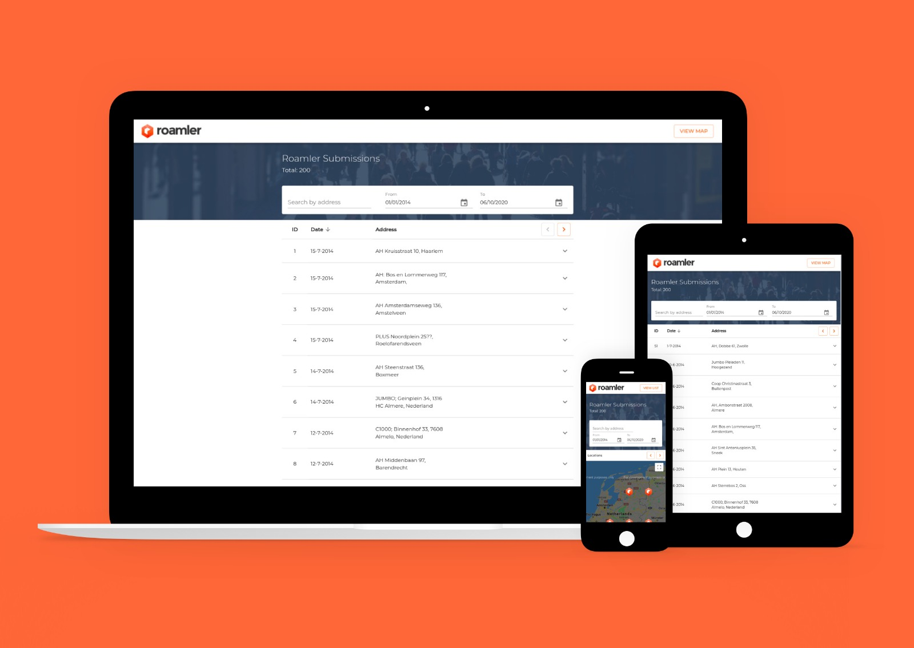

# Roamler subsmissions

Example app to display information about Roamler users submissions. 

## Description

The user can:

* View information regarding the submission (date, address, questions and answers given)
* View ten submissions at the time and navigate the table
* Sort submissions based on date
* Filter submissions based on address
* Choose a specific date range
* View submissions on map 
* Click on a location on map to view its submission 

## Technologies

* React
* Redux
* Material UI
* Styled components
* Superagent
* Node.js
* Express
* Postrges
* Axios

## How to run
1. Pull the repo
2. `yarn start` on the server. Make sure you have a postgres instance running on port `5432`. You can add a custom db url in the env config
3. `yarn start` on the client

## Next steps
* Add routing to app to expand features and make the search bookmarkable
* Save search preferences in local storage
* Add testing
* Improve usability of map
